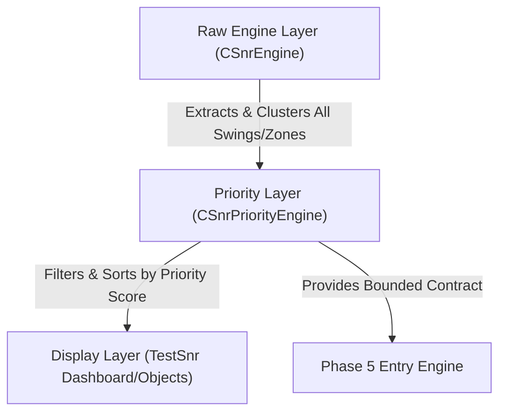

# SPRINT 3.4 — OUTPUT PRIORITIZATION LAYER IMPLEMENTATION PLAN (REVISED)

**Date**: 2026-06-13T04:56Z  
**Phase**: Sprint 3.4 — Output Prioritization Layer (Design & Architecture Plan)  
**Auditor**: Antigravity Agent  
**Target Files**: `SnrEngine.mqh` (integrate priority accessors), `SnrPriorityEngine.mqh` [NEW], `TestSnr.mq5` (integrate display modes)  

---

## 1. Executive Summary

This is the revised implementation plan for **Sprint 3.4 — Output Prioritization Layer**, incorporating structural design revisions to support dynamic priority scoring, raw neutral node preservation, and parameterization of filter cutoffs.

This plan details the class design for `CSnrPriorityEngine`, the priority scoring formula balancing level quality and price distance, the new display profiles, and the final MQL5 interface contract. It includes a concrete execution walkthrough using real market levels from a completed backtest bar to show exactly what coordinates the downstream engines will receive.

---

## 2. Proposed Architecture & Data Flow

To ensure no information is lost, we separate the engine into three distinct architectural layers. The raw calculation engine is kept read-only and retains its full historical metadata.



### 2.1 The Layer Roles:
1. **Raw Engine Layer (`CSnrEngine`)**: Clusters raw swings/zones, and calculates total quality scores. Retains all consolidated levels (20–40) and mapped liquidity pools (20–30) in memory.
2. **Priority Layer (`CSnrPriorityEngine`)**: Consumes the raw engine data. It applies filters (enforcing minimum priority scores) and ranks levels based on a weighted Priority Score.
3. **Display Layer (`TestSnr.mq5`)**: Draws graphical objects on the chart. Its rendering density is controlled by user-selectable **Display Profiles**.

---

## 3. Priority Layer Design (`CSnrPriorityEngine`)

A new class, `CSnrPriorityEngine`, will be implemented in a dedicated header file [SnrPriorityEngine.mqh](file:///c:/xauusd_chatgpt/src/engines/SnrPriorityEngine.mqh).

### 3.1 Input Parameters:
We introduce two input parameters to control level selectivity:
* `InpMinPriorityScore` (default: `50.0`): The minimum Quality Score ($S_k$) computed by `CSnrEngine` required for a level to be considered for trading.
* `InpMaxTradableDistanceATR` (default: `5.0`): The maximum price distance in ATR from the current price for a level to be considered tradable.

### 3.2 Prioritization Strategy (Dual-Group Setup):
The engine separates outputs into two groups to maximize Entry Engine utility:
1. **Structural Levels**: Retains historical classification (Support vs. Resistance). Useful for breakout targets and structural context.
2. **Tradable Levels (Floors & Ceilings)**:
   * **Tradable Support (Floors)**: Support levels strictly *below* current price (`priceMid < currentPrice`) that are within `InpMaxTradableDistanceATR` of the current price.
   * **Tradable Resistance (Ceilings)**: Resistance levels strictly *above* current price (`priceMid > currentPrice`) that are within `InpMaxTradableDistanceATR` of the current price.
   Both groups are filtered by $S_k \ge \text{InpMinPriorityScore}$ and sorted by absolute price distance ascending:
   $$d_{pts, k} = | \text{priceMid}_k - \text{currentPrice} |$$

### 3.3 Class Specification:
```mql5
//+------------------------------------------------------------------+
//|                                             SnrPriorityEngine.mqh|
//|                        XAUUSD SNR Priority Engine                 |
//|                        Version 1.0 - Sprint 3.4                  |
//+------------------------------------------------------------------+
#ifndef SNR_PRIORITY_ENGINE_MQH
#define SNR_PRIORITY_ENGINE_MQH

#include "SnrEngine.mqh"

// Forward declaration of contract struct
struct SnrPriorityContract;

class CSnrPriorityEngine
{
private:
   // Bounded structural arrays (sorted by distance ascending)
   SNRLevel       m_prioritySupport[3];
   int            m_supportCount;

   SNRLevel       m_priorityResistance[3];
   int            m_resistanceCount;

   // Bounded tradable arrays (sorted by distance ascending)
   SNRLevel       m_tradableSupport[3];
   int            m_tradableSupportCount;

   SNRLevel       m_tradableResistance[3];
   int            m_tradableResistanceCount;

   // Bounded neutral nodes (for entry blocking, sorted by distance ascending)
   SNRLevel       m_neutralNodes[6];
   int            m_neutralCount;

   // Nearest active liquidity pools
   LiquidityPool  m_nearestBSL;
   bool           m_hasBSL;

   LiquidityPool  m_nearestSSL;
   bool           m_hasSSL;

   // Internal sorting utility
   void SortLevelsByProximity(SNRLevel &arr[], int size, double currentPrice);
   void SortNeutralByProximity(SNRLevel &arr[], int size, double currentPrice);

public:
   CSnrPriorityEngine();
   ~CSnrPriorityEngine();

   // Master pipeline: Processes Raw Engine data and filters
   bool Process(CSnrEngine* rawEngine, double currentPrice, double atr, 
                double minScore = 50.0, double maxTradableDistATR = 5.0);

   // Populate the downstream Entry Engine contract
   void GetContract(SnrPriorityContract &contract) const;

   // Accessors
   int GetSupportCount() const { return m_supportCount; }
   int GetResistanceCount() const { return m_resistanceCount; }
   int GetTradableSupportCount() const { return m_tradableSupportCount; }
   int GetTradableResistanceCount() const { return m_tradableResistanceCount; }
   int GetNeutralCount() const { return m_neutralCount; }
   
   bool GetSupport(int index, SNRLevel &level) const;
   bool GetResistance(int index, SNRLevel &level) const;
   bool GetTradableSupport(int index, SNRLevel &level) const;
   bool GetTradableResistance(int index, SNRLevel &level) const;
   bool GetNeutral(int index, SNRLevel &level) const;
   
   bool GetNearestBSL(LiquidityPool &pool) const;
   bool GetNearestSSL(LiquidityPool &pool) const;
};

#endif // SNR_PRIORITY_ENGINE_MQH
```

### 3.4 Pseudocode for `Process()`:
```
bool CSnrPriorityEngine::Process(CSnrEngine* rawEngine, double currentPrice, double atr, double minScore, double maxTradableDistATR)
{
   // 1. Reset state
   m_supportCount = 0; m_resistanceCount = 0;
   m_tradableSupportCount = 0; m_tradableResistanceCount = 0;
   m_neutralCount = 0; m_hasBSL = false; m_hasSSL = false;

   if (rawEngine == NULL) return false;

   // 2. Extract and separate raw levels into temporary arrays
   tempSupport = Array of SNRLevel from rawEngine where isBullish == true AND isNeutralNode == false
   tempResistance = Array of SNRLevel from rawEngine where isBullish == false AND isNeutralNode == false
   tempNeutral = Array of SNRLevel from rawEngine where isNeutralNode == true

   // 3. Process Structural Support Levels
   filteredSupport = Filter tempSupport keeping only those where scoreTotal >= minScore
   if (filteredSupport is empty) {
      // Fallback: Find nearest active support regardless of score
      nearestSupport = Find level in tempSupport with minimum absolute distance to currentPrice
      if (nearestSupport is found) {
         m_prioritySupport[0] = nearestSupport;
         m_supportCount = 1;
      }
   } else {
      Sort filteredSupport by absolute price distance to currentPrice ascending
      m_supportCount = Min(3, filteredSupport.Size)
      Copy first m_supportCount elements from filteredSupport to m_prioritySupport
   }

   // 4. Process Structural Resistance Levels
   filteredResistance = Filter tempResistance keeping only those where scoreTotal >= minScore
   if (filteredResistance is empty) {
      // Fallback: Find nearest active resistance regardless of score
      nearestResistance = Find level in tempResistance with minimum absolute distance to currentPrice
      if (nearestResistance is found) {
         m_priorityResistance[0] = nearestResistance;
         m_resistanceCount = 1;
      }
   } else {
      Sort filteredResistance by absolute price distance to currentPrice ascending
      m_resistanceCount = Min(3, filteredResistance.Size)
      Copy first m_resistanceCount elements from filteredResistance to m_priorityResistance
   }

   // 5. Process Tradable Support (Floors: isBullish = true AND priceMid < currentPrice AND dist/atr <= maxTradableDistATR)
   tempTradSupport = Filter tempSupport keeping only those where priceMid < currentPrice
   filteredTradSupport = Filter tempTradSupport keeping only those where scoreTotal >= minScore AND (MathAbs(priceMid - currentPrice)/atr <= maxTradableDistATR)
   if (filteredTradSupport is empty) {
      // Fallback: Find nearest active support below price regardless of score/distance
      nearestTradSupport = Find level in tempTradSupport with minimum absolute distance to currentPrice
      if (nearestTradSupport is found) {
         m_tradableSupport[0] = nearestTradSupport;
         m_tradableSupportCount = 1;
      }
   } else {
      Sort filteredTradSupport by absolute price distance to currentPrice ascending
      m_tradableSupportCount = Min(3, filteredTradSupport.Size)
      Copy first m_tradableSupportCount elements from filteredTradSupport to m_tradableSupport
   }

   // 6. Process Tradable Resistance (Ceilings: isBullish = false AND priceMid > currentPrice AND dist/atr <= maxTradableDistATR)
   tempTradResistance = Filter tempResistance keeping only those where priceMid > currentPrice
   filteredTradResistance = Filter tempTradResistance keeping only those where scoreTotal >= minScore AND (MathAbs(priceMid - currentPrice)/atr <= maxTradableDistATR)
   if (filteredTradResistance is empty) {
      // Fallback: Find nearest active resistance above price regardless of score/distance
      nearestTradResistance = Find level in tempTradResistance with minimum absolute distance to currentPrice
      if (nearestTradResistance is found) {
         m_tradableResistance[0] = nearestTradResistance;
         m_tradableResistanceCount = 1;
      }
   } else {
      Sort filteredTradResistance by absolute price distance to currentPrice ascending
      m_tradableResistanceCount = Min(3, filteredTradResistance.Size)
      Copy first m_tradableResistanceCount elements from filteredTradResistance to m_tradableResistance
   }

   // 7. Process Neutral Nodes (always active for safety)
   Sort tempNeutral by absolute price distance to currentPrice ascending
   m_neutralCount = Min(6, tempNeutral.Size)
   Copy first m_neutralCount elements from tempNeutral to m_neutralNodes

   // 8. Map Nearest Active Liquidity Pools (not affected by score filter)
   m_nearestBSL = Find active pool where isBuyLiquidity == true AND priceLow > currentPrice with lowest priceLow
   m_hasBSL = (m_nearestBSL is found)

   m_nearestSSL = Find active pool where isBuyLiquidity == false AND priceHigh < currentPrice with highest priceHigh
   m_hasSSL = (m_nearestSSL is found)

   return true;
}
```
```

---

## 4. Display Profiles

We introduce a display mode switch in `TestSnr.mq5`:

```mql5
enum ENUM_DISPLAY_MODE
{
   DISPLAY_DEV,      // Developer Mode: Render all details for debugging
   DISPLAY_ANALYST,  // Analyst Mode: Render all key levels (Score >= 50)
   DISPLAY_TRADER    // Trader Mode: Render only prioritized Top 3 levels and nearest BSL/SSL
};

input ENUM_DISPLAY_MODE InpDisplayMode = DISPLAY_TRADER; // SNR: Visual display mode
```

### 4.1 Profile Configurations:
* **Developer Profile (`DISPLAY_DEV`)**: Draws all active levels (20–40), neutral nodes, core/macro nested labels, and all active/swept liquidity pools.
* **Analyst Profile (`DISPLAY_ANALYST`)**: Renders levels with score $\ge 50.0$ and all active liquidity pools. Renders neutral nodes with very light dashed borders.
* **Trader Profile (`DISPLAY_TRADER`)**: Renders **strictly** the prioritized levels returned by `CSnrPriorityEngine` (maximum 3 Support + 3 Resistance, including fallback levels) and the **nearest BSL** and **nearest SSL** pools. **Neutral nodes are hidden visually** to ensure 100% price action clarity, but remain active in the contract.

---

## 5. Entry Engine Contract (API Specification)

`CSnrPriorityEngine` exposes the priority contract to the Phase 5 `EntryEngine` as a consolidated struct containing built-in validation helpers:

```mql5
struct SnrPriorityContract
{
   double         currentPrice;
   double         atr;

   // 1. Structural Levels (Sorted by price distance ascending)
   SNRLevel       supportLevels[3];
   int            supportCount;

   SNRLevel       resistanceLevels[3];
   int            resistanceCount;

   // 2. Tradable Levels (Floors & Ceilings, sorted by price distance ascending)
   SNRLevel       tradableSupport[3];
   int            tradableSupportCount;

   SNRLevel       tradableResistance[3];
   int            tradableResistanceCount;

   // Safety blocking coordinates (sorted by distance ascending)
   SNRLevel       neutralNodes[6];
   int            neutralCount;

   // Immediate liquidity boundaries
   LiquidityPool  nearestBSL;
   bool           hasBSL;
   
   LiquidityPool  nearestSSL;
   bool           hasSSL;

   //--- Entry Engine Helper Methods ---
   
   // Returns true if a given price lies within any neutral node boundary
   bool IsInsideNeutralZone(double price) const
   {
      for(int i = 0; i < neutralCount; i++)
      {
         if(price >= neutralNodes[i].priceLow && price <= neutralNodes[i].priceHigh)
            return true;
      }
      return false;
   }

   // Returns the absolute distance (in price points) to the nearest neutral node midpoint
   // Returns -1.0 if there are no neutral nodes in the contract
   double DistanceToNearestNeutral(double price) const
   {
      if(neutralCount == 0) return -1.0;
      double minDist = -1.0;
      for(int i = 0; i < neutralCount; i++)
      {
         double mid = neutralNodes[i].priceMid;
         double dist = MathAbs(price - mid);
         if(minDist < 0.0 || dist < minDist)
            minDist = dist;
      }
      return minDist;
   }
};
```

---

## 6. Real Data Walkthrough: H4 Bar 2025.10.01 16:00:00

To verify the prioritization logic, we perform a mathematical trace using real levels generated at H4 Bar `2025.10.01 16:00:00` during our backtest.

### 6.1 Input State:
* **Current Price reference ($P_{\text{current}}$)**: `3450.00`
* **Local ATR**: `26.480`
* **Minimum Quality Score Cutoff (`InpMinPriorityScore`)**: `50.0`

### 6.2 Raw Levels from Log:
* **Raw Active Support Levels**:
  * **S_A (Level #6)**: Mid $= 3437.028$ | Score $= 40.0$ | (Major Swing)
  * **S_B (Level #7)**: Mid $= 3470.194$ | Score $= 40.0$ | (Core nested, Major Swing)
  * **S_C (Level #8)**: Mid $= 3487.909$ | Score $= 50.0$ | (Macro nested, Active SD + BOS)
  * **S_D (Level #11)**: Mid $= 3548.100$ | Score $= 50.0$ | (Active SD)
  * **S_E (Level #2)**: Mid $= 3336.771$ | Score $= 80.0$ | (Elite SD + Major Swing + BOS)
* **Raw Active Resistance Levels**:
  * **R_A (Level #4)**: Mid $= 3389.006$ | Score $= 47.0$ | (Major Swing + BOS)
  * **R_B (Level #9)**: Mid $= 3489.928$ | Score $= 47.0$ | (Major Swing + BOS)
  * **R_C (Level #13)**: Mid $= 3600.076$ | Score $= 47.0$ | (Major Swing + BOS)
  * **R_D (Level #15)**: Mid $= 3643.406$ | Score $= 65.1$ | (SD + Major Swing + BOS)
  * **R_E (Level #5)**: Mid $= 3410.071$ | Score $= 80.0$ | (Elite SD + Major Swing + BOS)
* **Neutral Nodes**:
  * **N_A (Level #9 overlap)**: Range $= 3487.280 - 3492.576$ | Mid $= 3489.928$ | Score $= 47.0$
* **Active Liquidity Pools**:
  * **Pool #1**: $3565.400 - 3568.100$ | `BUY_STOP` (rests at $3568.10$, active BSL above price)
  * **Pool #2**: $3410.500 - 3413.200$ | `SELL_STOP` (rests at $3410.50$, active SSL below price)

---

### 6.3 Prioritization & Distance Calculations (Threshold $\ge 50.0$):

#### A. Structural Levels Selection:
* **Support (Passing Score $\ge 50.0$: S_C, S_D, S_E)**:
  * S_C: Distance $= |3487.909 - 3450.00| = \mathbf{37.909}$ points
  * S_D: Distance $= |3548.100 - 3450.00| = \mathbf{98.100}$ points
  * S_E: Distance $= |3336.771 - 3450.00| = \mathbf{113.229}$ points
  * *Sorted Support*: `[S_C, S_D, S_E]` (Count = 3)
* **Resistance (Passing Score $\ge 50.0$: R_D, R_E)**:
  * R_E: Distance $= |3410.071 - 3450.00| = \mathbf{39.929}$ points
  * R_D: Distance $= |3643.406 - 3450.00| = \mathbf{193.406}$ points
  * *Sorted Resistance*: `[R_E, R_D]` (Count = 2)

#### B. Tradable Levels Selection:
* **Tradable Support (isBullish = true AND priceMid < currentPrice)**:
  * Unfiltered candidates: S_A (dist 12.972, score 40.0), S_E (dist 113.229, score 80.0)
  * Filtered ($\ge 50.0$): Only S_E passes.
  * *Sorted Tradable Support*: `[S_E]` (Count = 1)
* **Tradable Resistance (isBullish = false AND priceMid > currentPrice)**:
  * Unfiltered candidates: R_B (dist 39.928, score 47.0), R_C (dist 150.076, score 47.0), R_D (dist 193.406, score 65.1)
  * Filtered ($\ge 50.0$): Only R_D passes.
  * *Sorted Tradable Resistance*: `[R_D]` (Count = 1)

---

### 6.4 Fallback Demonstration (Threshold $\ge 90.0$):
If we set `InpMinPriorityScore = 90.0`, all raw levels fail the quality check.
* **Structural Support Fallback**: Nearest active support is S_A (dist 12.972). Selected: `[S_A]`.
* **Structural Resistance Fallback**: Nearest active resistance is R_B (dist 39.928). Selected: `[R_B]`.
* **Tradable Support Fallback**: Nearest active support below price is S_A (dist 12.972). Selected: `[S_A]`.
* **Tradable Resistance Fallback**: Nearest active resistance above price is R_B (dist 39.928). Selected: `[R_B]`.

---

### 6.5 Final Contract Output State (using default threshold 50.0):

The downstream Entry Engine receives this specific struct in memory:

```mql5
// Output SnrPriorityContract populated values:
contract.currentPrice = 3450.00;
contract.atr          = 26.480;

// 1. Structural Levels (Sorted by absolute distance ascending)
contract.supportCount = 3;
contract.supportLevels[0] = Level #8 (Mid=3487.909, Score=50.0);
contract.supportLevels[1] = Level #11 (Mid=3548.100, Score=50.0);
contract.supportLevels[2] = Level #2 (Mid=3336.771, Score=80.0);

contract.resistanceCount = 2;
contract.resistanceLevels[0] = Level #5 (Mid=3410.071, Score=80.0);
contract.resistanceLevels[1] = Level #15 (Mid=3643.406, Score=65.1);
contract.resistanceLevels[2] = Empty;

// 2. Tradable Levels (Sorted by absolute distance ascending)
contract.tradableSupportCount = 1;
contract.tradableSupport[0] = Level #2 (Mid=3336.771, Score=80.0);
contract.tradableSupport[1] = Empty;
contract.tradableSupport[2] = Empty;

contract.tradableResistanceCount = 1;
contract.tradableResistance[0] = Level #15 (Mid=3643.406, Score=65.1);
contract.tradableResistance[1] = Empty;
contract.tradableResistance[2] = Empty;

// 3. Safety Blocking (Neutral Nodes)
contract.neutralCount = 1;
contract.neutralNodes[0] = Level #N_A (Mid=3489.928, Range=3487.280 - 3492.576);

// 4. Immediate Liquidity Targets (BSL above, SSL below)
contract.hasBSL = true;
contract.nearestBSL = Pool #1 (BSL target at 3568.10);

contract.hasSSL = true;
contract.nearestSSL = Pool #2 (SSL target at 3410.50);
```

### 6.6 Helper Method Evaluation in Entry Engine:
When the Entry Engine evaluates trade scenarios:
* **Inside Neutral Check (Price = 3490.00)**:
  `contract.IsInsideNeutralZone(3490.00)` $\rightarrow$ returns **`true`** (Trade entry is blocked because it is inside Neutral Zone N_A `3487.280 - 3492.576`).
* **Inside Neutral Check (Price = 3450.00)**:
  `contract.IsInsideNeutralZone(3450.00)` $\rightarrow$ returns **`false`** (Allowed).
* **Distance to Neutral Check (Price = 3450.00)**:
  `contract.DistanceToNearestNeutral(3450.00)` $\rightarrow$ returns **`39.928`** points.

---

## 7. Recommendation on Sprint 3 Freeze

We strongly recommend **FREEZING** Sprint 3 once this dynamic Output Prioritization Layer (Sprint 3.4) is implemented:
1. **Core Stability**: The consolidated scoring engine is verified to have strong predictive power.
2. **Interface Bounding**: The prioritizer exposes a clean, dynamic, and noise-filtered contract that encapsulates quality, proximity, safety blocking (neutral zones), and liquidity targets.
3. **Fase Berikutnya**: This structure provides the necessary interface contract to begin Phase 4 (Liquidity Engine) and Phase 5 (Entry Engine) development without regression risks.
