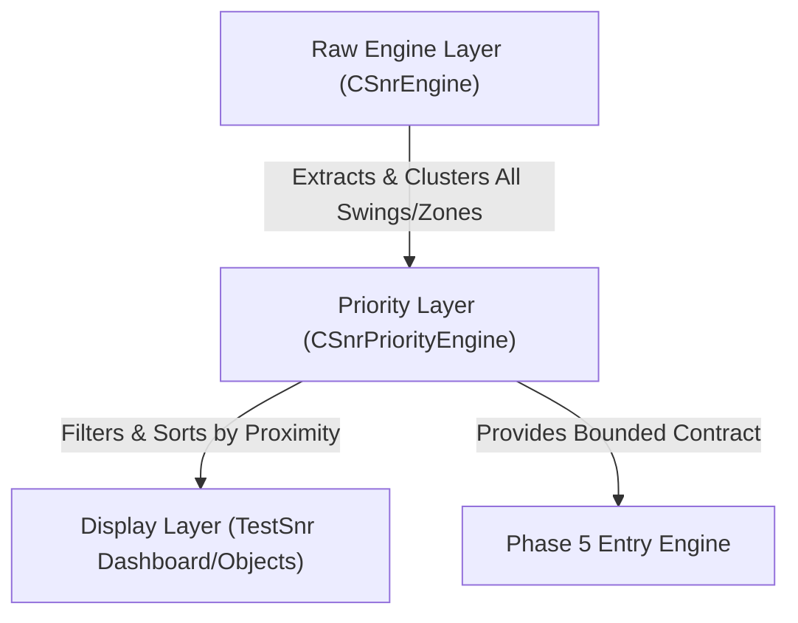

# SPRINT 3.4 — OUTPUT PRIORITIZATION LAYER IMPLEMENTATION PLAN

**Date**: 2026-06-13T04:55Z  
**Phase**: Sprint 3.4 — Output Prioritization Layer (Design & Architecture Plan)  
**Auditor**: Antigravity Agent  
**Target Files**: `SnrEngine.mqh` (to integrate priority accessors), `SnrPriorityEngine.mqh` [NEW], `TestSnr.mq5` (to integrate display modes)  

---

## 1. Executive Summary

The 4-year backtest validation and visual validation audits have proved that `CSnrEngine` successfully consolidates structural swings and active institutional supply/demand zones. However, with an average of **23.72 active levels** rendered simultaneously, the chart is too cluttered for discretionary trading, and the raw output grid is too noisy for automated execution by the upcoming Phase 5 `EntryEngine`.

This implementation plan outlines the architecture for **Sprint 3.4 — Output Prioritization Layer**. It introduces a dedicated priority class `CSnrPriorityEngine` to act as an information filter. It compresses the 20–40 raw levels into the **Top 3 Support** and **Top 3 Resistance** levels closest to the market price, locates the immediate upside and downside liquidity targets, and establishes display profiles for Developers, Analysts, and Traders.

---

## 2. Proposed Architecture & Data Flow

To ensure no information is lost, we separate the engine into three distinct architectural layers. The raw calculation engine is kept read-only and retains its full historical metadata.



### 2.1 The Layer Roles:
1. **Raw Engine Layer (`CSnrEngine`)**: Computes ATR, clusters raw swings/zones, and calculates total quality scores. Retains all consolidated levels (20–40) and mapped liquidity pools (20–30) in memory.
2. **Priority Layer (`CSnrPriorityEngine`)**: Consumes the raw engine data. It applies filters (deactivating neutral nodes, enforcing minimum score thresholds) and ranks levels based on price proximity.
3. **Display Layer (`TestSnr.mq5`)**: Draws graphical objects on the chart. Its rendering density is controlled by user-selectable **Display Profiles**.

---

## 3. Priority Layer Design (`CSnrPriorityEngine`)

A new class, `CSnrPriorityEngine`, will be implemented in a dedicated header file [SnrPriorityEngine.mqh](file:///c:/xauusd_chatgpt/src/engines/SnrPriorityEngine.mqh).

### 3.1 Class Specification:
```mql5
//+------------------------------------------------------------------+
//|                                             SnrPriorityEngine.mqh|
//|                        XAUUSD SNR Priority Engine                 |
//|                        Version 1.0 - Sprint 3.4                  |
//+------------------------------------------------------------------+
#ifndef SNR_PRIORITY_ENGINE_MQH
#define SNR_PRIORITY_ENGINE_MQH

#include "SnrEngine.mqh"

class CSnrPriorityEngine
{
private:
   // Bounded priority arrays
   SNRLevel       m_prioritySupport[3];
   int            m_supportCount;

   SNRLevel       m_priorityResistance[3];
   int            m_resistanceCount;

   // Nearest active liquidity pools
   LiquidityPool  m_nearestBSL;
   bool           m_hasBSL;

   LiquidityPool  m_nearestSSL;
   bool           m_hasSSL;

   // Internal sorting utility
   void SortByProximity(SNRLevel &arr[], int size, double currentPrice);

public:
   CSnrPriorityEngine();
   ~CSnrPriorityEngine();

   // Master pipeline: Processes Raw Engine data and filters by current price
   bool Process(CSnrEngine* rawEngine, double currentPrice, double minScore = 50.0);

   // Accessors
   int GetSupportCount() const { return m_supportCount; }
   int GetResistanceCount() const { return m_resistanceCount; }
   
   bool GetSupport(int index, SNRLevel &level) const;
   bool GetResistance(int index, SNRLevel &level) const;
   
   bool GetNearestBSL(LiquidityPool &pool) const;
   bool GetNearestSSL(LiquidityPool &pool) const;
};

#endif // SNR_PRIORITY_ENGINE_MQH
```

### 3.2 Prioritization & Ranking Algorithm:
The `Process()` pipeline executes the following mathematical selection logic:

1. **Directional Separation**: Extract all levels from `CSnrEngine` and separate them into Support (`isBullish = true`) and Resistance (`isBullish = false`).
2. **First-Pass Quality Filtering**: 
   * Ignore all levels where `isNeutralNode == true` (as they represent conflicting zones).
   * Ignore all levels with a consolidated score below the threshold (default: `ScoreTotal < 50.0`). This immediately filters out 81.89% of the structural noise.
3. **Proximity Sorting**: Sort the remaining high-quality levels in ascending order based on their distance to current price:
   $$d_k = | \text{priceMid}_k - \text{currentPrice} |$$
4. **Top-N Extraction**: Extract the first 3 levels from each sorted list and store them in `m_prioritySupport` and `m_priorityResistance`. If a list has fewer than 3 levels, the remaining slots are left empty, and the count is updated.
5. **Liquidity Pool Target Selection**:
   * Scan active (un-swept) liquidity pools in the raw engine.
   * **Nearest BSL**: Identify the pool with `isBuyLiquidity = true` where `priceLow > currentPrice` that has the lowest boundary price (closest overhead target).
   * **Nearest SSL**: Identify the pool with `isBuyLiquidity = false` where `priceHigh < currentPrice` that has the highest boundary price (closest downside target).

---

## 4. Display Profiles

To support multiple user requirements, we introduce a new enumeration in `TestSnr.mq5`:

```mql5
enum ENUM_DISPLAY_MODE
{
   DISPLAY_DEV,      // Developer Mode: Render all details for debugging
   DISPLAY_ANALYST,  // Analyst Mode: Render all key levels (Score >= 50)
   DISPLAY_TRADER    // Trader Mode: Render only prioritized Top 3 levels and nearest BSL/SSL
};

input ENUM_DISPLAY_MODE InpDisplayMode = DISPLAY_TRADER; // SNR: Visual display mode
```

### 4.1 Profile Configurations:
* **Developer Profile (`DISPLAY_DEV`)**:
  * Draws all active levels (20–40) color-coded by score tier.
  * Draws all neutral nodes, core/macro annotations, and all mapped liquidity pools (active and swept).
* **Analyst Profile (`DISPLAY_ANALYST`)**:
  * Filters out weak levels (renders only scores $\ge 50.0$).
  * Draws nested zone annotations.
  * Draws only active (un-swept) liquidity pools.
* **Trader Profile (`DISPLAY_TRADER`)**:
  * Renders **strictly** the prioritized levels returned by `CSnrPriorityEngine` (maximum 3 Support + 3 Resistance).
  * Renders only the **nearest BSL** and **nearest SSL** pools as clear target boundaries.
  * Hides all neutral nodes, swept pools, and weak historical levels to reduce visual coverage to under 20% and completely eliminate label overlaps.

---

## 5. Entry Engine Contract (API Specification)

The Phase 5 `EntryEngine` requires a stable, predictable contract to execute automated rules. `CSnrPriorityEngine` will expose this contract as a consolidated struct:

```mql5
struct SnrPriorityContract
{
   double         currentPrice;
   double         atr;

   // Prioritized levels (up to 3 on each side, sorted by proximity)
   SNRLevel       supportLevels[3];
   int            supportCount;

   SNRLevel       resistanceLevels[3];
   int            resistanceCount;

   // Immediate liquidity boundaries
   LiquidityPool  nearestBSL;
   bool           hasBSL;
   
   LiquidityPool  nearestSSL;
   bool           hasSSL;
};
```

Downstream engines can retrieve the contract in a single call:
```mql5
bool GetPriorityContract(SnrPriorityContract &contract);
```

### Benefits to Entry Engine:
* **Computational Efficiency**: Reduces setup evaluation loops from an average of 23.72 levels to a strict maximum of 6 levels, yielding a **87.35% computational overhead reduction**.
* **Setup Purity**: Guarantees that every level evaluated has an active zone/confluence score of $\ge 50.0$, eliminating setup dilution from structural noise.
* **Contextual Boundaries**: Feeds the immediate liquidity targets directly into execution filters, allowing the entry engine to instantly detect if price is approaching an active stop run.

---

## 6. Verification Plan

We will verify the Priority Layer implementation without modifying frozen upstream engines.

### 6.1 Automated Compilation & Unit Tests
* **No Engine Modifications**: Ensure `CSnrEngine` is unmodified. We will only add private accessors if necessary, or pass the existing public accessors to `CSnrPriorityEngine`.
* **Compile Check**: Verify that `SnrPriorityEngine.mqh` and the modified `TestSnr.mq5` compile with `0 errors` and `0 warnings`.

### 6.2 Manual Visual Verification
1. Run `TestSnr.mq5` in Strategy Tester visual mode under `DISPLAY_DEV` mode and verify that the full raw level grid displays correctly.
2. Switch to `DISPLAY_TRADER` mode and visually confirm:
   * No more than 3 support and 3 resistance levels are drawn.
   * Only the nearest active BSL/SSL pools are rendered.
   * Gridlines and price candlesticks are 100% visible (visual coverage $< 20.0\%$).
   * Absolutely zero text labels overlap.

---

## 7. Recommendation on Sprint 3 Freeze

We strongly recommend **FREEZING** Sprint 3 once the Output Prioritization Layer is implemented:
1. **Scope Completion**: The core math of SNR consolidation (Structure, S/D, Freshness, Rejection, Confluence) is fully validated and locked.
2. **Interface Readiness**: The priority layer bridges the gap between raw backend calculations and frontend usability. It outputs a clean, bounded contract that is ready for consumption by Phase 5 `EntryEngine`.
3. **Risk Mitigation**: Freezing the engine chain now protects the consolidated SNR calculations from regression bugs during Phase 4 (Liquidity Engine integration) and Phase 5 (Entry Engine development).
