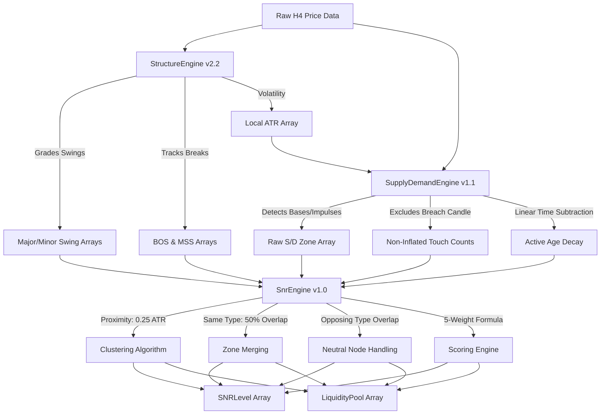

# SNR Engine v1.0 Data Flow Specification

**Author**: Quant Researcher & Market Structure Architect  
**Date**: June 12, 2026  
**Status**: APPROVED DESIGN  
**Target Module**: `SnrEngine.mqh` (Sprint 3.0)

---

## 1. Unidirectional Data Flow

The flow of data through the EA is strictly unidirectional. The **SNR Engine** acts as the synthesis layer that combines market structure and order blocks to map trading levels:



---

## 2. Sequential Processing Steps

The SNR Engine executes its pipeline in a strict chronological sequence during the EA's `OnTick()` loop (triggered only on new H4 bars):

```
[OnTick / New H4 Bar]
  |
  v
1. Call StructureEngine::Analyze() 
     -> Populate swings, trend state, BOS/MSS, and local ATR.
  |
  v
2. Call SupplyDemandEngine::Analyze() 
     -> Populate active and invalidated S/D zones with decay and reaction counts.
  |
  v
3. Call SnrEngine::Analyze()
     |
     +--> 3.1 Extract and Filter: Copy active zones and recent swings.
     |
     +--> 3.2 Merge: Apply same-type 50% overlap merge logic.
     |
     +--> 3.3 Cluster: Apply ATR-relative grouping to close price levels.
     |
     +--> 3.4 Resolve Conflicts: Flag nested cores and neutral decision nodes.
     |
     +--> 3.5 Score: Run the 5-metric scoring model for each SNR Level.
     |
     +--> 3.6 Map Liquidity: Define Stop-Loss clusters above/below key swings.
  |
  v
4. Render: Draw confluenced bands, core zones, and liquidity pools on the chart.
```

---

## 3. Inputs, Outputs, and Intermediate States

### 3.1 Upstream Inputs (Consumed by SNR)
*   `StructureResult`: Containing arrays of graded Swings, BOS/MSS events, and trend state.
*   `SupplyDemandZone[]`: Array of S/D zones (active and invalidated) with metadata.
*   `ATR`: Local ATR(14) value for the current bar index.

### 3.2 SNR Config Inputs (Tunable Parameters)
*   `InpSnrClusterToleranceATR` (Default `0.25`): Price distance multiplier for clustering.
*   `InpMaxClusterWidthATR` (Default `1.50`): Maximum allowed height for a consolidated SNR band.
*   `InpMergeOverlapRatio` (Default `0.50`): Minimum overlap ratio required to merge two same-type zones.
*   `InpMinRejectionATR` (Default `2.0`): Volatility multiplier to achieve maximum rejection score.

### 3.3 Outputs (Exposed to entry module)
*   `SNRLevel m_levels[]`: Stored sorted list of active confluenced support and resistance bands with their quality scores.
*   `LiquidityPool m_pools[]`: Stored list of buy/sell stop liquidity areas on the chart.
