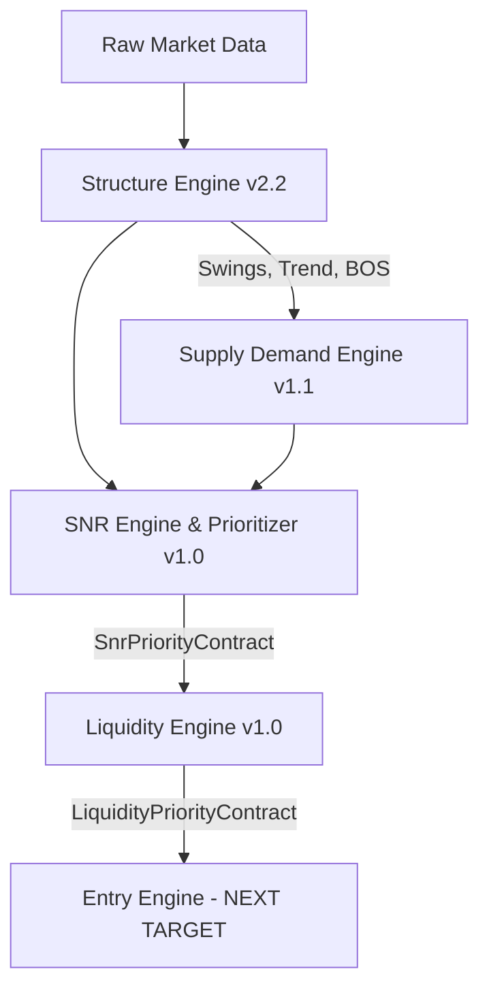

# PHASE 4 LIQUIDITY ENGINE — AGENT HANDOVER GUIDE

This handbook is designed to onboard a brand-new AI agent in **under 10 minutes** to resume the development of the XAUUSD Institutional EA.

---

## 1. System Pipeline Architecture

The trading robot is constructed as a unidirectional, decoupled pipeline of MQL5 classes located in `src/engines/`. Data flows as follows:

### Decoupled Code Contracts
Preceding modules are **strictly frozen** and cannot be modified. Communication between modules is governed by structures defined in the headers:
1.  **[SnrPriorityContract](file:///c:/xauusd_chatgpt/src/engines/SnrPriorityEngine.mqh)**: Exposes structural/tradable levels and nearest pool boundaries.
2.  **[LiquidityPriorityContract](file:///c:/xauusd_chatgpt/src/engines/LiquidityEngine.mqh)**: Exposes real-time sweep outcomes (`isBSLBreached`, `isBSLRejected`, `bslSweepSizeATR`, `isLargeExcursion`).

---

## 2. Core Phase 4 Research Conclusions

We ran a 4-year (2022–2025) Strategy Tester run using `TestLiquidityValidation.mq5` generating **522 events** on M30 data, and audited the edge robustness.

### 2.1 The Rejection Rate Illusion
*   The raw engine configuration yields a **99.62% rejection rate**.
*   **The Cause**: The pool width is extremely narrow (exactly **0.10 ATR** / $1.15 in Gold). Any M30 bar that barely penetrates a level and closes back across this narrow zone counts as a "rejection."
*   **Sensitivity**: Requiring the close to clear the inner boundary by a set buffer ATR reduces the rejection rate:
    *   `>= 0.00 ATR`: 100% rejection rate.
    *   `>= 0.10 ATR`: 74% rejection rate.
    *   `>= 0.20 ATR`: 52% rejection rate.
    *   `>= 0.50 ATR`: 10% rejection rate (only 69 events).

### 2.2 Expectancy & Trade Management
*   **Raw exits fail**: A simple time-based exit (exit after 12 bars) yields **negative net expectancy** for almost all strengths.
*   **The Asymmetric Edge**: A positive edge is unlocked only for **Group D (rejection margin $\ge 0.50$ ATR)** when paired with asymmetric risk parameters:
    *   **Take Profit**: **2.00 ATR** (captures the V-reversal momentum).
    *   **Stop Loss**: **1.00 ATR** (provides breathing room above Gold's median MAE of 0.627 ATR to avoid premature stop outs).
    *   **Time Exit**: Hard exit after **12 M30 bars** (6 hours) to close stagnant positions.
    *   *Result*: Expectancy of **$+0.1520$ ATR** and a **1.40 Profit Factor**.

---

## 3. Critical Risks & Vulnerabilities

1.  **Outlier Dependency**: The positive expectancy of $+0.1520$ ATR is extremely fragile. Removing the top 10% best events turns expectancy to **$-0.2548$ ATR**. If a few large V-reversal spikes are missed, the system is net unprofitable.
2.  **Temporal Instability**: The edge is highly regime-dependent. When segmented by year:
    *   **2023 (Trending)**: **Unprofitable** (Expectancy: $-0.1091$ ATR, PF: 0.74).
    *   **2024 (Mean-Reverting)**: **Spectacularly Profitable** (Expectancy: $+0.4599$ ATR, PF: 2.71).
    *   During trending years, stop runs turn into breakout trends, running over reversal trades.
3.  **Low Sample Size**: Group D sweeps average only **1.4 signals per month**.

---

## 4. Recommended Continuation Path (Phase 5)

Your immediate task is to design and implement the **Entry Engine (Module 5)** inside `src/engines/EntryEngine.mqh` and write its validation EA `src/tests/TestEntry.mq5`.

### Design Guidelines for CEntryEngine:
1.  **Filter by Strength**: Ignore all sweeps that do not satisfy `rejectionMarginATR >= 0.50` (Group D).
2.  **Implement H4 Trend Gating**:
    - Query `CStructureEngine` trend state or check swings.
    - If H4 trend is strongly trending (e.g. Bullish), **block BSL reversal trades (Shorts)**. Only trade SSL reversals (Longs).
    - This gating is mandatory to prevent drawdowns in trending environments (like 2023).
3.  **Risk Parameters**: Enforce `SL = 1.0 ATR`, `TP = 2.0 ATR`, and a market close exit after 12 M30 bars.
4.  **No Changes to Prior Modules**: Do not edit Structure, Supply-Demand, SNR, or Liquidity detection logic. Keep them frozen.
