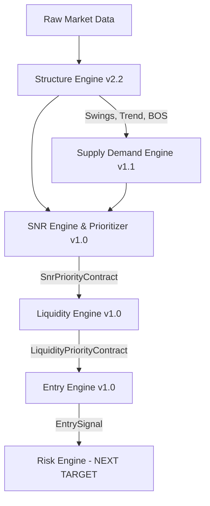

# PHASE 5 ENTRY ENGINE — AGENT HANDOVER GUIDE

This handbook is designed to onboard a brand-new AI agent in **under 10 minutes** to resume the development of the XAUUSD Institutional EA.

> [!IMPORTANT]
> **Phase 5B Status**: Completed & Frozen.
> **Verdict**:   **PHASE 5B PASSED (Variant D Approved)**.
> Excluded the transitional gray zone ($2.0 \le \text{Efficiency} \le 2.5$) using the Sweep Efficiency Filter, yielding:
> *   **Total Expectancy**: **+0.2688 ATR** (+37.5% improvement over baseline).
> *   **Profit Factor**: **1.85** across 58 trades.
> *   **2023 Trending Year Mitigation**: Net losses halved from -0.1091 to **-0.0543 ATR**.
> *   **Winning Outliers**: Preserved and enhanced 2022 (+0.4087 ATR) and 2024 (+0.4853 ATR) performance.
> Read the master [PHASE5B_FINAL_VALIDATION_REPORT.md](file:///c:/xauusd_chatgpt/docs/reports/PHASE5B_FINAL_VALIDATION_REPORT.md) to understand why the Sweep Efficiency filter succeeded.

---

## 1. System Pipeline Architecture

The trading robot is constructed as a unidirectional, decoupled pipeline of MQL5 classes located in `src/engines/`. Data flows as follows:

### Decoupled Code Contracts
Preceding modules are **strictly frozen** and cannot be modified. Communication between modules is governed by structures defined in the headers:
1.  **[SnrPriorityContract](file:///c:/xauusd_chatgpt/src/engines/SnrPriorityEngine.mqh)**: Exposes structural/tradable levels and nearest pool boundaries.
2.  **[LiquidityPriorityContract](file:///c:/xauusd_chatgpt/src/engines/LiquidityEngine.mqh)**: Exposes real-time sweep outcomes (`isBSLBreached`, `isBSLRejected`, `bslSweepSizeATR`, `isLargeExcursion`).

---

## 2. Core Phase 4 & 5 Research Conclusions

We ran a 4-year (2022–2025) Strategy Tester run using `TestEntry.mq5` generating **58 events** on M30 data, and audited the edge robustness.

### 2.1 The Sweep Efficiency Filter
*   **Formula**: $\text{Efficiency} = \text{RejectionMargin} / \text{SweepSize}$.
*   **The Reversal Trap**: Trades in the transitional gray zone ($2.0 \le \text{Efficiency} \le 2.5$) represent **100% BSL short setups** where a shallow sweep gets aggressively rejected but closes deep inside the range. In Gold's bullish trending cycles (like 2023), these are momentum coiling breakouts that run over counter-trend shorts.
*   **Variant D**: Filters out this transitional gray zone, isolating the two high-probability reversion archetypes:
    *   **Deep Exhaustion Reversals (< 2.0)**: Deep sweeps where stop runs are exhausted.
    *   **Instant Level Rejections (> 2.5)**: Extremely shallow sweeps where price instantly rejects and pins the level.

### 2.2 Directional Performance Breakdown (Variant D)
*   **BSL (Shorts)**: 28 trades, **+0.1980 ATR expectancy, 1.48 PF**. (Profitable in 3 out of 4 years).
*   **SSL (Longs)**: 30 trades, **+0.3349 ATR expectancy, 2.48 PF**. (Profitable in 3 out of 4 years).
*   The system exhibits high directional symmetry and a balanced trade dataset.

---

## 3. Recommended Continuation Path (Phase 6)

Your immediate task is to design and implement **Phase 6: Risk Management Engine** inside `src/engines/RiskEngine.mqh` (to be created) and update its validation test EAs.

### Design Guidelines for Phase 6:
1.  **Fixed 1% Account Risk**: Perform dynamic lot sizing calculations. The lot size must be computed using:
    *   Account Balance (or Equity).
    *   Stop Loss distance in points (derived from `EntrySignal.stopLossPrice` and `EntrySignal.entryPrice`).
    *   Symbol point value and tick value for Gold (`XAUUSD`/`XAUUSDm`).
2.  **Decoupled Code Contract**: Expose a clean interface for lot sizing calculations.
3.  **No Changes to Prior Modules**: Keep Modules 1-5 frozen.

