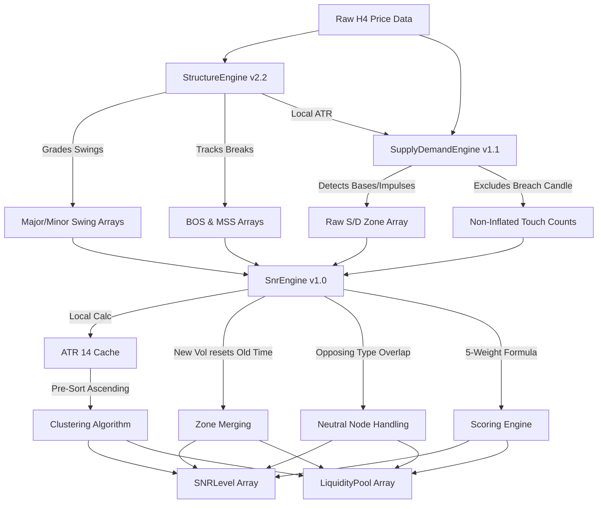

# SNR Engine v1.0 - Architectural Design Freeze

**Author**: Market Structure & Architecture Team  
**Date**: June 12, 2026  
**Status**: APPROVED & FROZEN SPECIFICATION  
**Target Module**: `SnrEngine.mqh` (Sprint 3.0)  
**Dependencies**: [StructureEngine.mqh (v2.2)](file:///c:/xauusd_chatgpt/src/engines/StructureEngine.mqh), [SupplyDemandEngine.mqh (v1.1)](file:///c:/xauusd_chatgpt/src/engines/SupplyDemandEngine.mqh)

---

## 1. Introduction & Objectives

This document represents the final, authoritative architecture specification for **Module 3 (Support, Resistance & Liquidity Engine - SNR Engine v1.0)**. It synthesizes all design elements, data flows, and scoring parameters, and incorporates all approved amendments from the Design Consistency Audit [SNR_DESIGN_AUDIT.md](file:///c:/xauusd_chatgpt/docs/audits/SNR_DESIGN_AUDIT.md).

No MQL5 source code may deviate from the specifications frozen herein.

```
+---------------------+     +--------------------------+     +------------------+
|   StructureEngine   | --> |    SupplyDemandEngine    | --> |    SnrEngine     |
|     (Version 2.2)   |     |      (Version 1.1)       |     |   (Version 1.0)  |
+---------------------+     +--------------------------+     +------------------+
```

---

## 2. Upstream Integration & Feeding Mechanism

The SNR Engine acts as a read-only synthesis layer. It holds reference pointers to the instantiated upstream engines and queries them during its execution cycle.

### 2.1 Pointers and Initialization
`CSnrEngine` maintains pointers to upstream instances:
```cpp
private:
   CStructureEngine*    m_structureEngine; // Upstream structure source
   CSupplyDemandEngine* m_sdEngine;        // Upstream supply/demand source
```

During initialization, references are validated:
```cpp
bool CSnrEngine::Init(CStructureEngine* structEngine, CSupplyDemandEngine* sdEngine)
{
   if(structEngine == NULL || sdEngine == NULL)
   {
      Print("[CSnrEngine] ERROR: Upstream dependency pointer is NULL");
      return false;
   }
   m_structureEngine = structEngine;
   m_sdEngine = sdEngine;
   return true;
}
```

### 2.2 Volatility (ATR) Ingestion
Because `CStructureEngine::GetATRValue()` is a `private` method in the frozen Module 1, the SNR Engine will compute ATR(14) **locally** using cached price arrays within its own class scope:
```cpp
// Local synchronous ATR calculation inside CSnrEngine
double CSnrEngine::CalculateLocalATR(int barIndex, int period=14);
```

### 2.3 Upstream Data Querying
During the analysis pipeline (triggered only on H4 bar closes), the engine:
1.  **Extracts Swings**: Polls Major and Minor Swing Highs/Lows from `CStructureEngine` using `m_structureEngine.GetMajorHigh()`, `m_structureEngine.GetMajorLow()`, `m_structureEngine.GetSwingHigh()`, and `m_structureEngine.GetSwingLow()`.
2.  **Extracts Zones**: Polls both active and recently invalidated zones (created within the last 150 bars to satisfy scoring criteria) from `CSupplyDemandEngine` using `m_sdEngine.GetZoneCount()` and `m_sdEngine.GetZone(i, zone)`.

---

## 3. Support & Resistance Clustering Rules

Raw levels are grouped into consolidated price bands using a volatility-relative clustering algorithm to avoid duplicate entries and visual clutter.

### 3.1 Pre-Sorting Requirement
To eliminate order-dependence during clustering, all projected levels (swing points and S/D zone boundaries) must be sorted in **price-ascending order** before the clustering projection loop is executed.

### 3.2 Clustering Algorithm Steps
1.  **Project**: Map price coordinates onto the vertical price axis:
    *   S/D Zone boundaries: `zoneHigh`, `zoneLow`
    *   Swing points: `price`
2.  **Proximity Check**: Group two adjacent projected levels $A$ and $B$ into the same cluster if:
$$\text{Distance}(A, B) \le \text{InpSnrClusterToleranceATR} \times \text{ATR}$$
    *   *Default Parameter*: `InpSnrClusterToleranceATR = 0.25` (H4 ATR).
3.  **Boundary Definition**:
$$\text{ClusterHigh} = \max(A_{\text{High}}, B_{\text{High}})$$
$$\text{ClusterLow} = \min(A_{\text{Low}}, B_{\text{Low}})$$
4.  **Cluster Cap Constraint**: A cluster cannot expand beyond:
$$\text{ClusterWidth} \le \text{InpMaxClusterWidthATR} \times \text{ATR}$$
    *   *Default Parameter*: `InpMaxClusterWidthATR = 1.50`.
    *   If a level would cause the cluster to exceed this width, it is rejected and begins a new cluster.

---

## 4. Zone Merge Rules

When two Supply zones or two Demand zones (same-type) overlap, they are merged under the following rules:

1.  **Overlap Ratio Condition**:
$$\frac{\min(Z_{1\text{High}}, Z_{2\text{High}}) - \max(Z_{1\text{Low}}, Z_{2\text{Low}})}{\min(Z_{1\text{Height}}, Z_{2\text{Height}})} \ge 0.50$$
2.  **Coordinates**: `MergedHigh = max(Z_1High, Z_2High)` and `MergedLow = min(Z_1Low, Z_2Low)`.
3.  **Freshness Reset (New Volume Prioritization)**:
    *   By default, the merged zone inherits the older creation time to compute decay conservatively, and the reaction count is summed (capped at 3).
    *   **Amendment**: If the *newer* zone's impulse range or body dominance exceeds the *older* zone's metrics by $\ge 20\%$, the level's creation time is reset to the newer zone's time, and the reaction count is set to 0. This prevents fresh institutional volume from being marked as stale.

---

## 5. Overlap & Conflict Handling

### 5.1 Supply vs. Resistance & Demand vs. Support (Confluence)
*   **Behavior**: A Supply zone overlaps a Major Swing High, or a Demand zone overlaps a Major Swing Low.
*   **Resolution**: They are consolidated. A Confluence Score of 100 ($S_{\text{Confl}} = 100$) is assigned, contributing a full 10.0 points to the total score under the Confluence Weight ($W_{\text{Confl}} = 0.10$).

### 5.2 Nested Zones (Core vs. Macro)
*   **Behavior**: A narrower zone lies completely inside a wider zone of the same type.
*   **Resolution**: Both are retained. The inner zone is flagged as the **Core Zone** and the outer as the **Macro Zone**. `EntryEngine` uses the Macro Zone to trigger alerts and the Core Zone for placing orders.

### 5.3 Conflicting Zones (Supply vs. Demand Overlap)
*   **Behavior**: Bearish Supply and Bullish Demand zones overlap (typical of tight range consolidations).
*   **Resolution**: Flagged as a **Neutral Decision Node**.
    *   **Action**: Both zones are temporarily deactivated; no trades are allowed within the overlapping range.
    *   **Release**: Resolved naturally when a closed H4 candle breaks past the boundaries, which invalidates the opposing zone in `CSupplyDemandEngine`.

---

## 6. Target MQL5 Data Structures

```cpp
//--- Represents a consolidated support/resistance level
struct SNRLevel
{
   int       id;                 // Unique identifier
   double    priceHigh;          // Top boundary of the level
   double    priceLow;           // Bottom boundary of the level
   double    priceMid;           // Median price (entry reference)
   bool      isBullish;          // true = Support/Demand, false = Resistance/Supply
   bool      isFresh;            // true = 0 reactions/touches
   int       reactionCount;      // Number of touch reactions
   double    scoreTotal;         // Quality score (0-100)
   
   //--- Confluence Flags
   bool      hasMajorSwing;      // Overlaps Major Swing
   bool      hasMinorSwing;      // Overlaps Minor Swing
   bool      hasActiveZone;      // Overlaps active S/D Zone
   bool      hasBOSOrigin;       // Aligned with a BOS origin bar
   int       constituentCount;   // Number of overlapping elements
   datetime  creationTime;       // Oldest element time (or reset time)
};

//--- Represents a high-density area of stop orders (Liquidity Pool)
struct LiquidityPool
{
   int       id;                 // Unique identifier
   double    priceHigh;          // Top boundary of pool
   double    priceLow;           // Bottom boundary of pool
   bool      isBuyLiquidity;     // true = Buy Stops (above highs), false = Sell Stops (below lows)
   double    liquidityStrength;  // Strength rating (based on swing scores and age)
   bool      isSwept;            // Whether price has run this pool
   datetime  sweptTime;          // Time of sweep
};
```

---

## 7. The Scoring Model

The Total SNR Score is calculated as:

$$\text{Score}_{\text{SNR}} = (W_{\text{Struct}} \times S_{\text{Struct}}) + (W_{\text{SD}} \times S_{\text{SD}}) + (W_{\text{Fresh}} \times S_{\text{Fresh}}) + (W_{\text{Reject}} \times S_{\text{Reject}}) + (W_{\text{Confl}} \times S_{\text{Confl}})$$

### 7.1 Weight Assignments
*   $W_{\text{Struct}} = 0.20$ (Structure Weight)
*   $W_{\text{SD}} = 0.30$ (Supply/Demand Weight)
*   $W_{\text{Fresh}} = 0.20$ (Freshness Weight)
*   $W_{\text{Reject}} = 0.20$ (Rejection Score Weight)
*   $W_{\text{Confl}} = 0.10$ (Confluence Weight)
*   **Total Weights Sum**: $1.00$ (Guarantees score range of 0-100 without arbitrary clipping).

### 7.2 Parameter Score Matrix

1.  **Structure Score ($S_{\text{Struct}}$)**:
    *   Overlaps a **Major Swing**: `100` points.
    *   Overlaps a **Minor Swing**: `50` points.
    *   No swing overlap: `0` points.
2.  **Supply/Demand Score ($S_{\text{SD}}$)**:
    *   Overlaps an **Active S/D Zone**: `100` points.
    *   Overlaps an **Invalidated S/D Zone**: `30` points.
    *   No S/D overlap: `0` points.
3.  **Freshness Score ($S_{\text{Fresh}}$)**:
    *   0 touches (Fresh): `100` points.
    *   1 touch: `60` points.
    *   2 touches: `30` points.
    *   $\ge 3$ touches (Depleted): `0` points.
4.  **Rejection Score ($S_{\text{Reject}}$)** (Bounce Strength):
$$S_{\text{Reject}} = \min\left(100.0, \frac{\text{AvgRejectionDistance}}{\text{ATR}} \times 50.0\right)$$
    *   Rejection measured by searching price history for the reaction bar and computing the price excursion.
    *   Untouched levels: $S_{\text{Reject}} = 0$.
5.  **Confluence Score ($S_{\text{Confl}}$)**:
    *   S/D Zone + Major Swing Overlap: `100` points.
    *   Multiple S/D Zones Overlap: `100` points.
    *   Major Swing + BOS Origin Overlap: `70` points.
    *   S/D Zone + Minor Swing Overlap: `50` points.
    *   No Overlap: `0` points.

---

## 8. Worked Examples (Using Real Zones from Backtest)

### Example 1: SUPPLY-4550.188-4434.21 (Pristine Supply Zone)
*   **Context**: Created at `2025.12.29 12:00` at the all-time high. No swing points exist in this price range.
*   **Metrics**:
    *   $S_{\text{Struct}} = 0$
    *   $S_{\text{SD}} = 100$ (Active)
    *   $S_{\text{Fresh}} = 100$
    *   $S_{\text{Reject}} = 0$ (0 reactions)
    *   $S_{\text{Confl}} = 0$
*   **Score Calculation**:
$$\text{Score}_{\text{SNR}} = (0.20 \times 0) + (0.30 \times 100) + (0.20 \times 100) + (0.20 \times 0) + (0.10 \times 0) = 50.0$$

### Example 2: SUPPLY-2659.206-2628.487 (High-Confluence Major Resistance)
*   **Context**: Created at `2024.10.08 12:00`, aligned with a Bearish BOS origin bar and a Major Swing High.
*   **Metrics**:
    *   $S_{\text{Struct}} = 100$ (Major Swing)
    *   $S_{\text{SD}} = 100$ (Active)
    *   $S_{\text{Fresh}} = 100$
    *   $S_{\text{Reject}} = 0$
    *   $S_{\text{Confl}} = 100$ (S/D + Major Swing)
*   **Score Calculation**:
$$\text{Score}_{\text{SNR}} = (0.20 \times 100) + (0.30 \times 100) + (0.20 \times 100) + (0.20 \times 0) + (0.10 \times 100) = 80.0$$

### Example 3: DEMAND-1994.276-1965.416 (Retested Demand Level)
*   **Context**: Created at `2023.11.21 12:00` overlapping with a Minor Swing Low. Price has touched the zone 2 times since creation, with an average rejection distance of 1.2 ATR.
*   **Metrics**:
    *   $S_{\text{Struct}} = 50$ (Minor Swing)
    *   $S_{\text{SD}} = 100$ (Active)
    *   $S_{\text{Fresh}} = 30$ (2 touches)
    *   $S_{\text{Reject}} = 60$ (Rejection score: $\frac{1.2}{2.0} \times 100 = 60.0$)
    *   $S_{\text{Confl}} = 50$ (S/D + Minor Swing)
*   **Score Calculation**:
$$\text{Score}_{\text{SNR}} = (0.20 \times 50) + (0.30 \times 100) + (0.20 \times 30) + (0.20 \times 60) + (0.10 \times 50) = 63.0$$

---

## 9. Data Flow & Tick Execution Pipeline



### Sequential Tick Process (New H4 Bar Close Only)
1.  **Structure Sync**: Call `CStructureEngine::Analyze()`.
2.  **S/D Sync**: Call `CSupplyDemandEngine::Analyze()`.
3.  **Local ATR Calculation**: `CSnrEngine` calculates ATR(14) locally for the current bar index.
4.  **Filtering & Sorting**: Extract active major/minor swings and active/invalidated zones (within last 150 bars). Sort all price coordinates in ascending order.
5.  **Merge & Cluster**: Perform same-type merges (applying the $\ge 20\%$ newer-zone prioritization rule) and project sorted levels using the $0.25 \times ATR$ tolerance.
6.  **Scoring & Conflict Resolution**: Flag nested nodes and neutral decision nodes. Score all final consolidated bands using the 5-weight formula.
7.  **Liquidity Mapping**: Map buy/sell stop liquidity pools above/below swing high/low clusters.
8.  **Output**: Render SNR levels and liquidity pools on the chart.
