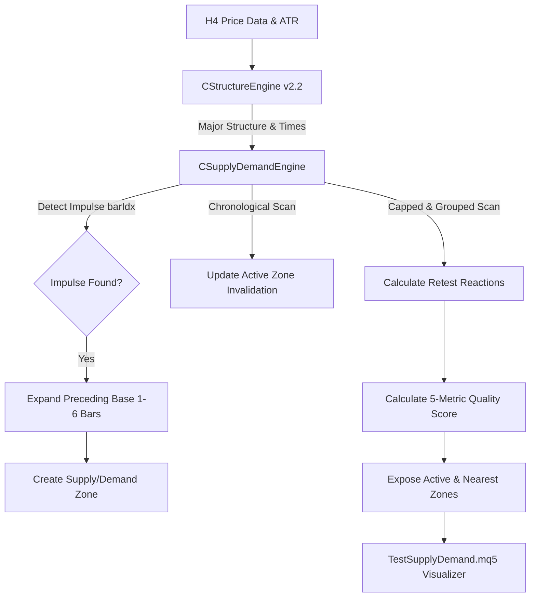

# Supply & Demand Engine v1.0 Design Documentation

**Author**: Quant Researcher & Institutional Market Structure Auditor  
**Date**: June 12, 2026  
**Status**: Completed  
**Target Module**: [SupplyDemandEngine.mqh](file:///c:/xauusd_chatgpt/src/engines/SupplyDemandEngine.mqh)  

---

## 1. Architectural Philosophy

Institutional Supply and Demand (S&D) zones represent pools of unfilled institutional orders (order blocks) left behind when price moves rapidly away from a consolidation region. The engine detects these zones using the **Impulse-Base-Displacement** model,consuming structural outputs from [StructureEngine.mqh](file:///c:/xauusd_chatgpt/src/engines/StructureEngine.mqh) and H4 OHLC price data.

---

## 2. Core Detection Principles

### 2.1 Impulse Move (Displacement)
An impulse move represents significant displacement, indicating heavy institutional buying or selling.
A candle at index `X` qualifies as an **Impulse Candle** if:
1.  **Volatility Scale (Range)**:
    $$\text{High}_X - \text{Low}_X \ge \text{InpMinImpulseATR} \times \text{ATR}(14)_X$$
    *(Default multiplier: 2.0)*
2.  **Momentum Scale (Body Dominance)**:
    $$\frac{|\text{Close}_X - \text{Open}_X|}{\text{High}_X - \text{Low}_X} \ge \text{InpMinBodyDominance}$$
    *(Default threshold: 60%)*

*   **Direction**:
    *   $\text{Close}_X > \text{Open}_X \rightarrow$ **Bullish Impulse** (Creates a Demand Zone).
    *   $\text{Close}_X < \text{Open}_X \rightarrow$ **Bearish Impulse** (Creates a Supply Zone).

### 2.2 Base Candle Consolidation (1 to 6 Candles)
The base represents the consolidation block immediately preceding the breakout. The engine supports **1 to 6 candles** in the base:
1.  The base begins at the candle immediately preceding the impulse: `baseEnd = X + 1`.
2.  The engine scans backward up to 6 candles (`X + 1` to `X + 6`) to include preceding bars into the base.
3.  **Expansion Termination**: The base expansion stops immediately if any preceding candle is also an impulse candle. This prevents merging separate impulse zones into a single base block.
4.  **Zone Boundaries**:
    $$\text{ZoneHigh} = \max(\text{High}_{X+1}, \dots, \text{High}_{X+N})$$
    $$\text{ZoneLow} = \min(\text{Low}_{X+1}, \dots, \text{Low}_{X+N})$$
    *(Where $N$ is the size of the base, $1 \le N \le 6$)*

---

## 3. Zone State & Invalidation Tracking

Zones are tracked chronologically from oldest to newest. Invalidation occurs on a completed H4 candle close:
*   **Demand Zone Invalidation**:
    $$\text{Close}_{\text{current}} < \text{ZoneLow}$$
*   **Supply Zone Invalidation**:
    $$\text{Close}_{\text{current}} > \text{ZoneHigh}$$

Once a zone is invalidated, its state transitions to `isInvalidated = true`, and the invalidation bar index and time are permanently locked.

---

## 4. Retest Reactions & Defect Protections

To prevent reaction leak and inflation (as solved in Structure Engine v2.2), reactions to the zone are tracked using strict structural constraints:
1.  **Capped Scan**: Reaction scanning stops at the bar where the zone was invalidated (`invalidatedBar`). No reactions are counted post-invalidation (no reaction leak).
2.  **Touch Definition**: A bar is counted as a touch/reaction if its High-Low range overlaps with the zone price boundaries:
    $$\text{High}_{\text{bar}} \ge \text{ZoneLow} \quad \text{and} \quad \text{Low}_{\text{bar}} \le \text{ZoneHigh}$$
3.  **Consolidation Grouping**: Consecutive bars overlapping with the zone are grouped as a single reaction event using an `insideZone` state tracker. Price must exit the zone before a new retest reaction is counted (no reaction inflation).

---

## 5. Scoring Framework (0-100 Scale)

Each zone is evaluated on a 0-100 scale using five metrics:

$$\text{Total Score} = (\text{Score}_{\text{Impulse}} \times 0.3) + (\text{Score}_{\text{Freshness}} \times 0.3) + (\text{Score}_{\text{Age}} \times 0.2) + (\text{Score}_{\text{Reaction}} \times 0.2)$$

### 5.1 Impulse Strength Score (Weight: 30%)
Evaluates the breakout force using a combination of the ATR ratio and body dominance:
*   $$\text{ATR Ratio} = \frac{\text{ImpulseRange}}{\text{ATR}}$$
*   $$\text{Score}_{\text{Impulse}} = \min\left(100.0, \frac{\text{ATR Ratio}}{2.0} \times 50.0 + \text{BodyDominance} \times 50.0\right)$$

### 5.2 Freshness Score (Weight: 30%)
Measures how many times the zone has been tested. High freshness is preferred for initial touches:
*   $$0 \text{ reactions} \rightarrow \text{Freshness} = 100.0$$
*   $$1 \text{ reaction} \rightarrow \text{Freshness} = 50.0$$
*   $$2 \text{ reactions} \rightarrow \text{Freshness} = 25.0$$
*   $$\ge 3 \text{ reactions or Invalidated} \rightarrow \text{Freshness} = 0.0$$

### 5.3 Age Score (Weight: 20%)
Decays linearly over time to prioritize newer, more relevant institutional zones:
*   $$\text{Age} = \text{CurrentBar} - \text{ImpulseBarIndex}$$
*   $$\text{Score}_{\text{Age}} = \max(0.0, 100.0 - \text{Age} \times 0.25)$$
    *(Reaches 0 after 400 bars)*

### 5.4 Reaction Score (Weight: 20%)
Measures the number of times price has tested and rejected the zone, demonstrating its structural strength as historical support/resistance:
*   $$\text{Score}_{\text{Reaction}} = \min(100.0, \text{ReactionCount} \times 33.3)$$
    *(Caps at 3 reactions)*

---

## 6. Data Flow

