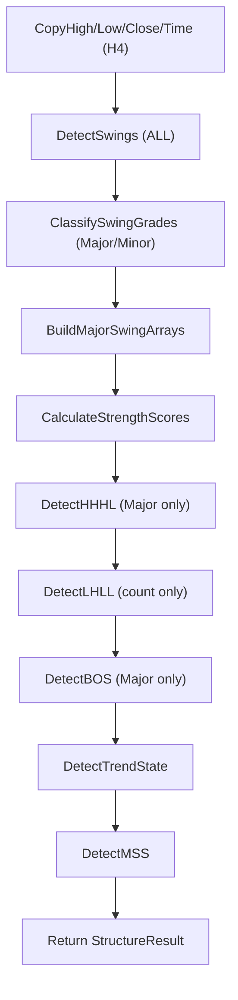

# StructureEngine.mqh v2.0 — Full Audit

## 1. How Every System Works

### 1.1 Swing Detection ([DetectSwings](file:///c:/xauusd_chatgpt/StructureEngine.mqh#L534-L591))

**Method**: Fractal-based. A bar is a Swing High if the N bars on each side all have strictly lower highs. Swing Low is the mirror. N defaults to 3.

**Scan direction**: Oldest bar → newest bar (barIndex from `totalBars-1-N` down to `N`). The rightmost N bars are excluded (not yet confirmed). Arrays are stored oldest-first.

**Result**: All detected swings go into `m_swingHighs[]`, `m_swingLows[]`, and `m_allSwings[]`.

---

### 1.2 Major / Minor Classification ([ClassifySwingGrades](file:///c:/xauusd_chatgpt/StructureEngine.mqh#L600-L713))

**Rule**: A swing is **Major** if the absolute price-distance from the previous **Major** swing of the same type is `>= 0.5 × ATR(14)` at that bar. Otherwise it is **Minor**.

**Behavior**:
- The very first swing high and very first swing low are always Major (no prior to compare with)
- Comparison is always against the **last Major** swing, not the last swing overall — this prevents minor swings from resetting the comparison baseline
- Highs and Lows are classified **independently** (they have separate chains)

---

### 1.3 HH / HL / LH / LL Classification ([DetectHHHL](file:///c:/xauusd_chatgpt/StructureEngine.mqh#L891-L988))

**Uses**: `m_majorHighs[]` and `m_majorLows[]` only. Minor swings are never labeled.

**Logic**:
- For each Major swing high (starting from index 1): if `price > previous major high price` → **HH**, else → **LH**
- For each Major swing low (starting from index 1): if `price > previous major low price` → **HL**, else → **LL**
- First Major swing of each type remains `LABEL_NONE` (no prior reference)

Labels are then synced back to `m_swingHighs[]`, `m_swingLows[]`, and `m_allSwings[]`.

---

### 1.4 BOS Detection ([DetectBOS](file:///c:/xauusd_chatgpt/StructureEngine.mqh#L1026-L1144))

**Uses**: `m_majorHighs[]` and `m_majorLows[]` only.

**Bullish BOS**: For each Major swing high, scan bars newer than it. If the **first** bar's Close > swing high price, check: `breakDistance >= 0.25 × ATR(14)`. If yes → BOS_BULLISH. Only the first valid break per swing is recorded.

**Bearish BOS**: Mirror logic for Major swing lows.

**Stopping rule**: The scan stops if a newer Major swing high/low exists before the current check bar (the `hIdx < majorHighCount - 1 && checkBar <= m_majorHighs[hIdx+1].barIndex` guard).

---

### 1.5 MSS Detection ([DetectMSS](file:///c:/xauusd_chatgpt/StructureEngine.mqh#L1152-L1227))

**Method**: Iterates BOS events from oldest to newest, maintaining a "running trend" that mirrors the trend-determination logic (2 consecutive same-direction BOS = trend confirmed).

- **Bullish MSS**: Running trend was BEARISH, and a BOS_BULLISH occurs → MSS_BULLISH
- **Bearish MSS**: Running trend was BULLISH, and a BOS_BEARISH occurs → MSS_BEARISH

> [!IMPORTANT]
> MSS uses its own **internal running trend** computed from BOS sequence. It does NOT use the `DetectTrendState()` output. These two trend calculations are **independent and may diverge**.

---

### 1.6 Trend State ([DetectTrendState](file:///c:/xauusd_chatgpt/StructureEngine.mqh#L1236-L1287))

**Uses**: `m_majorHighs[]` and `m_majorLows[]` labels.

**Logic**: Counts **consecutive** HH/LH labels backward from the newest Major high. Same for HL/LL from the newest Major low. The counting stops at the first `LABEL_NONE` swing (the very first major swing, which has no label).

- `recentHH >= 2 AND recentHL >= 2` → **BULLISH**
- `recentLH >= 2 AND recentLL >= 2` → **BEARISH**
- Otherwise → **RANGE**

---

### 1.7 Strength Score ([CalculateStrengthScores](file:///c:/xauusd_chatgpt/StructureEngine.mqh#L791-L884))

Calculated for Major swings only. Three weighted components:

| Component | Weight | Formula | Max Score |
|---|---|---|---|
| ATR Displacement | 40% | `min(100, (distFromPrev / ATR) × 50)` | 100 (at 2× ATR) |
| Reaction Count | 35% | `min(100, reactions × 25)` | 100 (at 4 reactions) |
| Age | 25% | `max(0, 100 − barIndex × 0.25)` | 100 (at bar 0) |

**Reaction**: Any bar after the swing whose high/low is within `0.15 × ATR` of the swing level.

**Final**: `score = (atrScore × 40 + reactionScore × 35 + ageScore × 25) / 100`

---

### 1.8 Analyze() Pipeline ([Analyze](file:///c:/xauusd_chatgpt/StructureEngine.mqh#L1302-L1413))



---

## A. Current Architecture Review

### Kelebihan

1. **Clean separation of concerns** — each function does exactly 1 task as per coding rules
2. **Major/Minor filter** — reduces noise significantly vs. raw fractal detection
3. **No look-ahead bias** — scan direction is past→present; reactions only counted on bars after the swing
4. **Configurable thresholds** — all magic numbers are input parameters
5. **Comprehensive logging** — every detection step is logged with full context
6. **Struct-based data model** — clean, extensible, easy for downstream modules to consume
7. **ATR-relative thresholds** — adapts automatically to different volatility regimes

### Kekurangan

1. **O(N²) sync operations** — `DetectHHHL`, `ClassifySwingGrades`, and `CalculateStrengthScores` all contain nested loops that search by `barIndex` to sync labels/grades between parallel arrays. This is O(N²) complexity.

2. **Redundant arrays** — `m_swingHighs`, `m_majorHighs`, and `m_allSwings` contain overlapping data that is manually kept in sync. This triple-storage is fragile and error-prone.

3. **No incremental update** — `Analyze()` re-scans ALL bars from scratch on every new H4 bar. This violates the Coding Rules which say to use "New Bar Detection + Cache + Incremental Update."

4. **BOS events are not sorted** — bullish and bearish BOS events are appended in separate passes (all bullish first, then all bearish). The `m_bosEvents[]` array is NOT chronologically ordered.

5. **ArrayResize called inside loops** — every swing/BOS/MSS detection does `ArrayResize(arr, size+1)` inside the loop, which causes frequent memory reallocation instead of pre-allocating.

---

### Potensi Bug

> [!CAUTION]
> **BUG 1: BOS detection has premature exit logic**

At [L1056-L1087](file:///c:/xauusd_chatgpt/StructureEngine.mqh#L1056-L1087) (and the bearish mirror at [L1107-L1138](file:///c:/xauusd_chatgpt/StructureEngine.mqh#L1107-L1138)):

```
if(closePrice > swingPrice)
{
    // check ATR validation...
    if(valid) { record BOS; break; }
    break;   // ← THIS IS THE PROBLEM
}
```

The **outer `break`** fires on the FIRST bar that closes above the swing high, regardless of whether the ATR distance check passed. If the first bar that closes above doesn't meet the ATR requirement, the entire swing is **permanently skipped**. A valid BOS on a later bar will never be found.

**Impact**: Significant — will miss real BOS events where the first close above is weak but a subsequent bar makes a strong break.

---

> [!CAUTION]
> **BUG 2: MSS uses unsorted BOS events**

`DetectMSS()` iterates `m_bosEvents[]` assuming chronological order from oldest to newest. But `DetectBOS()` appends all bullish BOS first (oldest→newest), then all bearish BOS (oldest→newest). The result is:

```
m_bosEvents[] = [Bull_old, Bull_mid, Bull_new, Bear_old, Bear_mid, Bear_new]
```

This is NOT chronological. `DetectMSS()` will see all bullish events first, potentially establishing a bullish running trend before seeing any bearish events. This leads to **incorrect MSS timing and missed MSS events**.

**Impact**: Critical — MSS detection is fundamentally unreliable.

---

> [!WARNING]
> **BUG 3: First Major swing always gets strength score 0**

At [L804](file:///c:/xauusd_chatgpt/StructureEngine.mqh#L804): `displacement = m_majorHighs[hIdx].distanceFromPrev`, and the first Major swing has `distanceFromPrev = 0.0` (set at [L612](file:///c:/xauusd_chatgpt/StructureEngine.mqh#L612)). This gives ATR displacement score = 0. Combined with high age (oldest bar = largest barIndex), the first Major swing will always score very low.

Not a crash, but produces misleading score for the foundational swing.

---

> [!WARNING]
> **BUG 4: Trend state counts break at LABEL_NONE**

At [L1247-L1265](file:///c:/xauusd_chatgpt/StructureEngine.mqh#L1247-L1265), the loop counts consecutive HH/LH backward from the newest swing but **breaks** when it hits `LABEL_NONE`. The first Major swing always has `LABEL_NONE`, so the loop always terminates there. But this also means if there are only 3 Major swing highs (1 NONE + 2 classified), the count will correctly reach 2. However, the counting for highs and lows is **independent** — in a market with 2 recent HH but only 1 HL, it will stay RANGE even though the structure is clearly bullish.

This is correct per spec (need 2 of each), but the independent counting means HH and HL can be from completely different time windows, which is misleading.

---

> [!WARNING]
> **BUG 5: Reaction count is biased toward older swings**

Old swings have more bars after them → more opportunities for reactions → higher reaction scores. But age scoring penalizes old swings. The two components partially cancel, but the reaction component (35% weight) can dominate, making old, heavily-tested swings score disproportionately high even when they are no longer relevant.

---

> [!WARNING]
> **BUG 6: Equal-price swings are misclassified**

In `DetectHHHL()` at [L901](file:///c:/xauusd_chatgpt/StructureEngine.mqh#L901): `if(price > previousPrice)` → HH, else → LH. If two consecutive Major swing highs have the **exact same price**, the second is classified as LH (bearish). This is incorrect — equal highs are not a bearish signal. They indicate accumulation/ranging. Same issue exists for swing lows.

---

> [!NOTE]
> **BUG 7: `barAge` uses barIndex directly**

At [L819](file:///c:/xauusd_chatgpt/StructureEngine.mqh#L819): `int age = m_majorHighs[hIdx].barIndex`. In series arrays, `barIndex=0` is the newest bar and `barIndex=499` is the oldest. So `barAge` is the distance in bars from the current bar, which is semantically correct. However, this value changes every time `Analyze()` runs (a swing at physical bar X will have different barIndex as new bars form). This is acceptable but worth noting — the age score is dynamically recalculated, not static.

---

### Potensi False Signal

| # | False Signal | Cause | Severity |
|---|---|---|---|
| 1 | **Ghost BOS** | BOS only checks the FIRST close above/below. If a wick (high/low) goes above but close doesn't, the swing is ignored. But if the first close barely breaks and doesn't meet ATR → entire swing is abandoned (Bug 1). Real BOS on later bars is missed. | HIGH |
| 2 | **Phantom MSS** | MSS fires based on unsorted BOS sequence (Bug 2). Could detect "shift" events that don't exist chronologically. | HIGH |
| 3 | **Range flip-flop** | With only 3-4 Major swings detected, a single new swing can flip trend from BULLISH → RANGE → BEARISH in rapid succession. No hysteresis or confirmation delay. | MEDIUM |
| 4 | **False HH/HL in range** | In ranging markets, price oscillates around a mean. The ATR filter helps, but if the range width ≥ 0.5 ATR, alternating Major swings will create alternating HH/LH/HL/LL labels that don't represent a real trend. | MEDIUM |
| 5 | **ATR-dependent classification** | During volatility compression, ATR drops → 0.5 ATR becomes very small → more swings qualify as Major → noise returns. During expansion, ATR rises → valid swings get filtered as Minor. The filter is pro-cyclical. | LOW-MEDIUM |

---

### Potensi Performance Issue

| # | Issue | Location | Impact |
|---|---|---|---|
| 1 | **Full rescan every bar** | `Analyze()` copies and re-analyzes all 500 bars on every new H4 bar. At 4h bars this is ~6 calls/day so not critical, but wasteful. | LOW |
| 2 | **O(N²) array syncing** | `DetectHHHL` has 3 nested loops syncing labels between `m_majorHighs → m_swingHighs → m_allSwings`. With 50 Major highs × 100 all swings = 5000 iterations × 3 = 15K iterations. | LOW |
| 3 | **CountReactions scans all subsequent bars** | For old swings (barIndex=400), this scans 400 bars. With 20 Major swings × 400 bars = 8000 iterations. | LOW |
| 4 | **ArrayResize(+1) in loops** | Each swing detection does `ArrayResize(arr, size+1)`. MQL5 may reallocate memory on every call. Should pre-allocate with reserve. | LOW |

> Overall performance is acceptable for H4 timeframe (only runs ~6 times/day), but the architecture would not scale to M1/M5.

---

## B. Trading Logic Review

### Apakah logika market structure sudah benar?

**Partially correct.** The conceptual framework (fractal swings → HH/HL/LH/LL → BOS → MSS → Trend) follows standard SMC/ICT methodology. However:

> [!CAUTION]
> **Critical Logic Error: BOS checks ALL Major swings independently**

The spec says: *"Close harus menutup di atas **swing high terakhir**."* (Close must close above the **last** swing high.)

The current implementation checks EVERY Major swing high for a break, not just the most recent one. This produces multiple BOS events — one per swing high that gets broken. In reality, only the **last unbroken swing high/low** should generate a BOS event.

**Example**: If there are 5 Major swing highs and price eventually goes above all of them, the engine will generate 5 separate BOS events instead of tracking which swing is the "active" level.

---

> [!WARNING]
> **Swing Highs and Lows are classified independently**

The engine separates swing highs and swing lows into completely independent arrays. It classifies HH/LH by comparing swing high to previous swing high, and HL/LL by comparing swing low to previous swing low. It does NOT consider the **alternating sequence** of highs and lows.

In real market structure:
- A valid bullish cycle is: **HL → HH → HL → HH** (alternating)
- The current logic would detect HH if the latest high is above the previous high, regardless of what happened to the lows in between

This means the engine could declare **BULLISH** (2 HH + 2 HL) even if the HH and HL occurred in different, non-overlapping time periods.

---

### Apakah ada kesalahan konsep?

1. **BOS concept is too broad**: Every broken Major swing counts as a separate BOS. In SMC, BOS refers to breaking the **most recent significant swing** in the direction of continuation. The engine should track an "active" swing high and "active" swing low, and only trigger BOS when that specific level is broken.

2. **MSS has a chicken-and-egg problem**: MSS requires knowing the "running trend" which is built from BOS events. But the BOS events are unsorted (Bug 2) and over-counted (the issue above). MSS detection is built on a shaky foundation.

3. **No concept of "swing invalidation"**: When a swing high is broken, the swings that formed part of that structure should be invalidated. The engine never invalidates or updates previous swings.

---

### Apakah ada asumsi yang terlalu sederhana?

| Assumption | Why it's too simple | Better approach |
|---|---|---|
| Major/Minor = pure price distance | Time between swings is ignored. Two swings 0.6 ATR apart but only 2 bars apart are likely noise, not major structure. | Add minimum bar-distance requirement (e.g., >= 5 bars apart) |
| HH/HL comparison = sequential | Compares swing N to swing N-1. Doesn't consider whether a higher-timeframe structure makes the current sequence relevant. | Consider contextual structure (e.g., only classify after a full cycle: high→low→high) |
| BOS = any close beyond level | No body-dominance check. A doji closing 1 pip above counts the same as a full-body momentum candle. | Add body ratio filter (e.g., body > 50% of candle range) |
| Reaction count = any proximity | A bar whose high is near the level could be noise. True reactions should show rejection (long wick, failed close). | Add rejection quality check (wick ratio, subsequent bar direction) |
| Age score = linear decay | Linear 0.25/bar decay means age maxes at 400 bars. XAUUSD H4 = 500 bars ≈ 83 days. Score goes to 0 at 67 days. | Use exponential decay or tier-based scoring |

---

## C. Improvement Plan

### Priority 1 — Critical Bugs (Fix before any trading)

| # | Task | Why |
|---|---|---|
| **P1.1** | **Fix BOS premature exit** — Remove the outer `break` after ATR validation fails. Continue scanning subsequent bars for a valid break. | Bug 1: Causes missed BOS events |
| **P1.2** | **Sort BOS events chronologically** — After DetectBOS appends all events, sort `m_bosEvents[]` by barIndex descending (oldest first) before DetectMSS runs. | Bug 2: MSS is fundamentally broken without sorted BOS |
| **P1.3** | **Track "active" swing level for BOS** — Only the most recent unbroken Major swing high/low should generate a BOS. Don't scan old already-broken swings. | Critical logic error: over-generates BOS |
| **P1.4** | **Handle equal-price swings** — Add tolerance: `abs(price - prevPrice) < 0.01 * ATR` → leave as LABEL_NONE (not HH, not LH). | Bug 6: Misclassification of ranging structure |

---

### Priority 2 — Logic Improvements (Better signal quality)

| # | Task | Why |
|---|---|---|
| **P2.1** | **Add minimum bar-distance for Major swing** — Require at least N bars (e.g., 5) between consecutive Major swings of the same type, in addition to the ATR distance filter. | Prevents two adjacent bars from both being Major |
| **P2.2** | **Require alternating high-low sequence** — Only classify HH/HL when swings alternate properly (HL must come after HH, not independently). | Reduces false bullish/bearish detection in ranges |
| **P2.3** | **Add body-dominance filter to BOS** — BOS candle should have body > 50% of range, or at minimum close convincingly beyond the level. | Reduces BOS triggered by doji/indecision candles |
| **P2.4** | **Improve reaction count quality** — A true reaction should show: touch within tolerance + rejection (subsequent bar doesn't continue through). Count consecutive touches as 1 reaction, not multiple. | Reduces inflated reaction scores |
| **P2.5** | **Normalize first Major swing score** — Give the first swing a baseline displacement score based on the swing range itself (high-low of swing candle / ATR). | Bug 3: First swing always scores very low |

---

### Priority 3 — Quality of Life / Performance

| # | Task | Why |
|---|---|---|
| **P3.1** | **Pre-allocate arrays with reserve** — Use `ArrayResize(arr, 0, 64)` to reserve 64 elements. Reduce reallocation overhead. | Performance: eliminates per-element realloc |
| **P3.2** | **Eliminate redundant sync loops** — Use a single index lookup table (barIndex → array index) instead of nested O(N²) searches. Or operate directly on the major arrays and only sync once at the end. | Performance + code clarity |
| **P3.3** | **Add Trend transition states** — Instead of instant BULLISH → RANGE → BEARISH jumps, add BULLISH_WEAKENING / BEARISH_WEAKENING to signal early shifts. | Better signal for downstream modules |
| **P3.4** | **Add swing invalidation** — When a swing high is broken by BOS, mark it as INVALIDATED. Don't use invalidated swings for future comparisons. | Conceptual correctness |
| **P3.5** | **Add incremental mode** — Cache the previous analysis result and only process new bars on each call, merging results with the existing swing array. | Per coding rules: "incremental update" |

---

> [!IMPORTANT]
> **Menunggu persetujuan Anda sebelum melakukan perubahan kode apapun.**
> Silakan review audit ini dan beri tahu prioritas mana yang ingin dikerjakan lebih dulu, atau jika ada pertanyaan tentang temuan di atas.
